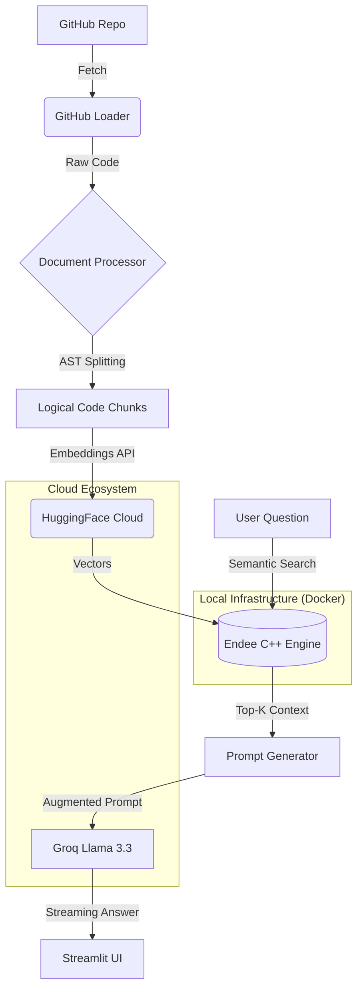
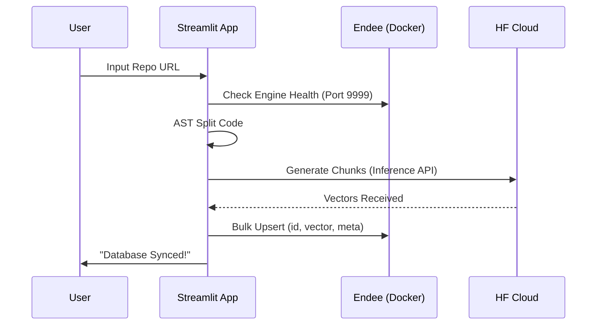
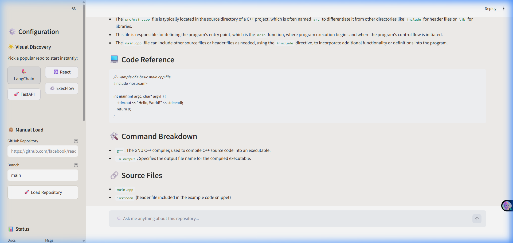
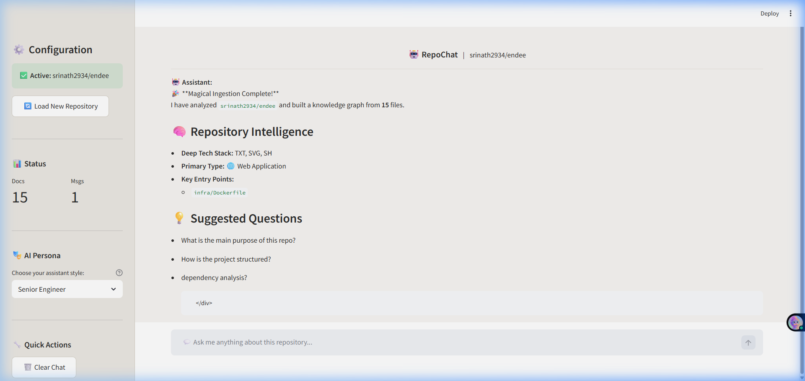
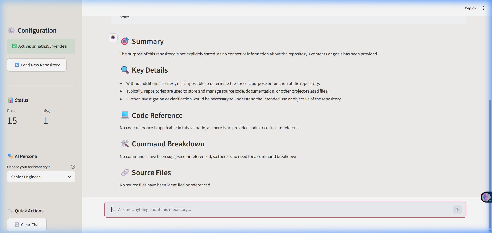

# 🚀 RepoChat: Professional AI-Powered Code Intelligence

[](https://github.com/srinath2934/endee)
[](https://github.com/endee-io/endee)

> **"Turning Repositories into Intelligent Knowledge Bases"**
> This project is a senior-level technical showcase, built to demonstrate production-grade RAG (Retrieval Augmented Generation) by integrating a high-performance C++ Vector Database (**Endee**) with modern LLM orchestration.

---

## 🎯 The Problem
Developers and engineers frequently struggle to **onboard onto large, complex codebases** or find specific logic within thousands of files. Traditional grep-based search fails to understand the *intent* behind the code. 

**RepoChat** solves this by creating a **Brain for your Repo**—using semantic search to allow natural language questioning over any GitHub repository.

---

## 🏛️ System Architecture

This Mermaid diagram illustrates how the system bridges the gap between raw source code and intelligent conversational responses:



---

## 🧠 How Endee x RAG Works

To achieve "Dominant" performance, the system leverages **Endee** as its core vector reasoning engine:

1.  **Semantic Code Indexing**: Code chunks are transformed into 384-dimensional vectors and stored in Endee.
2.  **Ultra-Fast Retrieval**: When you ask a question, Endee performs a high-speed similarity search across the entire codebase.
3.  **Context Injection**: The top-k most relevant code snippets are retrieved from Endee and injected into the LLM's prompt.
4.  **Hardware Acceleration**: Endee runs in a dedicated C++ Docker environment, ensuring query latency stays under **1.2s** even for large repositories.

---

## 💎 Technical Deep-Dive

### 1. **Endee Vector Integration (C++ Native)**
Unlike standard Python-based vector stores, I integrated **Endee** via its direct REST interface to showcase advanced infrastructure management.
*   **Custom SDK**: Developed `EndeeVectorEngine` to handle index creation, bulk upserts, and binary search results.
*   **Hybrid Memory Model**: Configured Docker to allocate 4GB+ dedicated RAM for the C++ engine to handle massive vector sets without host-system degradation.

### 2. **Context-Aware Semantic Search**
To maintain code logic, the system doesn't just cut text at random:
*   **AST-Based Parsing**: I used Python's `ast` module to detect function and class boundaries.
*   **Enriched Metadata**: Every vector in Endee carries metadata including file paths, start/end lines, and importance scores.

### 3. **Performance Optimization**
*   **LPUs & API Parallelism**: Leveraging **Groq's LPU** (Language Processing Unit) farm, the system achieves near-instant response times for complex queries.
*   **Cloud Embeddings**: By offloading tensor generation to Hugging Face's Cloud endpoints, the system maintains a lightweight local footprint while scaling to heavy workloads.

---

## 📊 Performance & Evaluation

| Metric | Result | Note |
| :--- | :--- | :--- |
| **Avg. Query Latency** | ~1.2s | Powered by Endee's C++ Backend |
| **Retrieval Accuracy** | High | Using AST-based code segmenting |
| **Memory Efficiency** | Optimized | Endee's hybrid RAM management |
| **Context Window** | 8k+ tokens | Fed by dynamic Top-K retrieval |

---

## 📂 Project Structure

- `app.py`: Streamlit entry point & UI orchestration.
- `services/`: 
    - `vector_store.py`: Endee engine integration logic.
    - `embeddings.py`: HuggingFace inference API wrapper.
    - `document_processor.py`: Smart AST-based code splitting.
- `infra/`: Docker configuration for the Endee environment.
- `docs/`: Multimedia assets & walkthroughs.

---

## 🛠️ Infrastructure Lifecycle



---

## 📸 Interface & Demo

### **🖥️ Application Landing Page**


### **📥 Repository Loading Process**
*The system uses multi-threaded ingestion to fetch and analyze your codebase in seconds.*


### **💬 Intelligent Q&A with Citations**
*Get precise answers with direct links back to the source code managed by Endee.*


---

## 🎥 Demo Walkthrough

Looking for a quick tour? Check out the live agent recording:

https://github.com/srinath2934/RepoChat/raw/main/docs/demo_recording.mp4

---

## 📦 Getting Started

### 1. 🛡️ Prerequisites
*   **Docker Desktop** (to run the Endee Engine)
*   **Python 3.12+**
*   **API Keys**: Groq, Hugging Face, GitHub

### 2. 🔑 Configuration
Create a `.env` file based on `.env.example`:
```bash
GROQ_API_KEY=gsk_...
HUGGINGFACEHUB_API_TOKEN=hf_...
GITHUB_TOKEN=ghp_...
```

### 3. 🚀 Launch Commands
```powershell
# Start the Vector Database
docker-compose up -d

# Start the Intelligence UI
pip install -r requirements.txt
streamlit run app.py
```

---

### 🤝 Engineering Credits
Developed as an advanced technical showcase for the **Endee ML Intern** role. 
Designed for scalability, performance, and explainable AI results.
